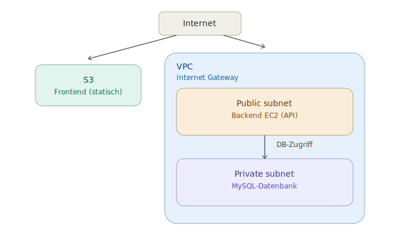

# Autohaus Royal

Fullstack web application for a German car dealership built with React, NestJS, and MySQL.

## Tech Stack

- **Frontend:** React 18, TypeScript, Vite, Tailwind CSS, React Router, Zustand
- **Backend:** NestJS, TypeORM, JWT Authentication
- **Database:** MySQL 8 (Docker)

## Features

- Vehicle catalog with filters (brand, category, fuel type, price, year)
- Vehicle detail page with test drive booking
- Admin panel (protected with JWT)
  - Add, edit, and delete vehicles
  - View appointments
- Landing page with reviews and footer
- Contact, About, and Careers pages

## Architecture

The app runs inside a VPC: the frontend is served from an S3 bucket, the backend API runs in the public subnet, and MySQL lives in the private subnet, only reachable from the backend.

## Getting Started

### Prerequisites

- Node.js v20+
- pnpm
- Docker Desktop

### Installation

1. Clone the repository

\`\`\`bash
git clone https://github.com/YOUR_USERNAME/autohaus.git
cd autohaus
\`\`\`

2. Start MySQL with Docker

\`\`\`bash
docker-compose up -d
\`\`\`

3. Setup the backend

\`\`\`bash
cd apps/api
cp .env.example .env
pnpm install
pnpm start:dev
\`\`\`

4. Setup the frontend

\`\`\`bash
cd apps/web
pnpm install
pnpm dev
\`\`\`

### Access

| Service | URL |
|---|---|
| Frontend | http://localhost:5173 |
| Backend API | http://localhost:3000 |
| Admin Panel | http://localhost:5173/admin |

### Default Admin Credentials

Create an admin user by sending a POST request to:

\`\`\`
POST http://localhost:3000/auth/register
{
  "email": "admin@autohaus.de",
  "password": "your_password"
}
\`\`\`

## API Endpoints

### Vehicles
| Method | Endpoint | Description |
|---|---|---|
| GET | /vehicles | Get all vehicles (with filters) |
| GET | /vehicles/:id | Get vehicle by ID |
| POST | /vehicles | Create vehicle |
| PATCH | /vehicles/:id | Update vehicle |
| DELETE | /vehicles/:id | Delete vehicle |

### Appointments
| Method | Endpoint | Description |
|---|---|---|
| GET | /appointments | Get all appointments |
| POST | /appointments | Create appointment |

### Auth
| Method | Endpoint | Description |
|---|---|---|
| POST | /auth/login | Login |
| POST | /auth/register | Register admin user |

## Project Structure

\`\`\`
autohaus/
├── apps/
│   ├── web/          # React frontend
│   └── api/          # NestJS backend
├── terraform/        # AWS infrastructure (VPC, EC2, S3, MySQL) - see terraform/README.md
├── docker-compose.yml
└── package.json
\`\`\`

## Vercel Project Link:
https://cas-auto-real-web.vercel.app/