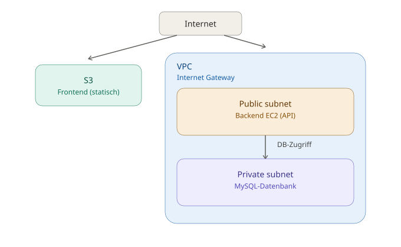

# CasAuto Real

Fullstack web application for a German car dealership built with React, NestJS, and MySQL.

## Tech Stack

- **Frontend:** React 19, TypeScript, Vite, Tailwind CSS, React Router, Zustand
- **Backend:** NestJS, TypeORM, JWT Authentication
- **Database:** MySQL 8 (Docker)

## Features

- Vehicle catalog with filters (brand, category, fuel type, price, year), UI available in German, English, and Spanish
- Vehicle detail page with test drive booking (no account needed)
- Customer registration/login, separate from the admin login
- Favorites/watchlist — save vehicles and revisit them on `/merkliste`. Requires being logged in; saved per account, in `localStorage` (not synced across devices/browsers)
- Vehicle comparison — select up to 3 vehicles and compare them side by side on `/vergleich`. Same login requirement and per-account local storage as favorites
- Newsletter signup
- Admin panel (JWT-protected, requires the `admin` role - see [Default Admin Credentials](#default-admin-credentials))
  - Add, edit, and delete vehicles
  - View appointments
- Landing page with reviews carousel and footer
- Contact, About, and Careers pages

## Architecture

The diagram shows the originally planned design: the app inside a VPC, frontend served from an S3 bucket, backend API in the public subnet, MySQL in the private subnet only reachable from the backend. The actual, currently-deployed setup deviates from this in two ways - see [Deployment (Production)](#deployment-production) for what's actually live:

> **Note:** the frontend is served from **Vercel**, not S3 - simpler to deploy and update than syncing a bucket, and Vercel's proxy rewrite (`apps/web/vercel.json`) is what lets the browser reach the backend over HTTPS without mixed-content issues (see [How the pieces connect](#how-the-pieces-connect)).
>
> **Note:** MySQL runs in the **public subnet**, restricted to the backend by security group rather than subnet isolation - see [terraform/README.md](terraform/README.md) for why.

## Getting Started

### Prerequisites

- Node.js v20+
- pnpm
- Docker Desktop

### Installation

1. Clone the repository

\`\`\`bash
git clone https://github.com/Lucasle6/CasAuto-Real.git
cd CasAuto-Real
\`\`\`

2. Start MySQL with Docker

\`\`\`bash
docker-compose up -d
\`\`\`

3. Setup the backend

\`\`\`bash
cd apps/api
cp .env.example .env
pnpm install
pnpm start:dev
\`\`\`

4. Setup the frontend

\`\`\`bash
cd apps/web
pnpm install
pnpm dev
\`\`\`

### Access

| Service | URL |
|---|---|
| Frontend | http://localhost:5173 |
| Backend API | http://localhost:3000 |
| Admin Panel | http://localhost:5173/admin |

### Default Admin Credentials

`POST /auth/register` (also used by the customer-facing `/register` page) always creates a user with the `user` role - it does **not** grant admin access, regardless of what email you register with. To get an admin account:

1. Register normally:

\`\`\`
POST http://localhost:3000/auth/register
{
  "email": "admin@autohaus.de",
  "password": "your_password"
}
\`\`\`

2. Then promote that user to admin directly in the database:

\`\`\`sql
UPDATE users SET role = 'admin' WHERE email = 'admin@autohaus.de';
\`\`\`

Log in at `/admin/login` (or via the navbar's "Anmelden" button) with that account to reach the admin panel.

## API Endpoints

"Auth" below means the request needs an `Authorization: Bearer <token>` header from an account with the `admin` role (see [`auth/admin.guard.ts`](apps/api/src/auth/admin.guard.ts)); everything else is open, no token needed.

### Vehicles
| Method | Endpoint | Description | Auth |
|---|---|---|---|
| GET | /vehicles | Get all vehicles (with filters) | – |
| GET | /vehicles/:id | Get vehicle by ID | – |
| POST | /vehicles | Create vehicle | admin |
| PATCH | /vehicles/:id | Update vehicle | admin |
| DELETE | /vehicles/:id | Delete vehicle | admin |

### Appointments
| Method | Endpoint | Description | Auth |
|---|---|---|---|
| GET | /appointments | Get all appointments | admin |
| POST | /appointments | Create appointment (test drive booking) | – |

### Auth
| Method | Endpoint | Description | Auth |
|---|---|---|---|
| POST | /auth/login | Log in, returns a JWT | – |
| POST | /auth/register | Register a new account (always created with the `user` role - see [Default Admin Credentials](#default-admin-credentials)) | – |

### Newsletter
| Method | Endpoint | Description | Auth |
|---|---|---|---|
| POST | /newsletter/subscribe | Subscribe an email to the newsletter | – |
| GET | /newsletter/subscribers | List subscribers | admin |

> In production these endpoints are reached through the `/api` proxy, e.g. `GET /api/vehicles` on the frontend resolves to `GET /vehicles` on the backend. See [Deployment](#deployment-production).

## Project Structure

\`\`\`
CasAuto-Real/
├── apps/
│   ├── web/          # React frontend
│   └── api/          # NestJS backend
├── scripts/          # One-off maintenance/seed scripts - see scripts/seed-vehicles.mjs
├── terraform/        # AWS infrastructure (VPC, EC2, MySQL) - see terraform/README.md
├── docker-compose.yml
└── package.json
\`\`\`

## Deployment (Production)

The app is deployed and live. The frontend runs on **Vercel**; the backend and database run on **AWS**, provisioned with Terraform.

| Piece | Where | Address |
|---|---|---|
| Frontend | Vercel | https://cas-auto-real-web.vercel.app |
| Backend API | AWS EC2 (Elastic IP) | `http://3.77.123.218:3000` |
| Database | Self-hosted MySQL 8 on EC2 | Private, reachable only from the backend |

### How the pieces connect

The browser only ever talks to Vercel over HTTPS. Requests to `/api/*` are rewritten by [`apps/web/vercel.json`](apps/web/vercel.json) to the backend's Elastic IP, so Vercel proxies them to the backend server-side over HTTP and the browser never sees mixed content. `VITE_API_URL` is set to `/api` in the Vercel project, so every `${VITE_API_URL}/...` call resolves to the proxied path.

The backend is an EC2 instance that builds `apps/api/Dockerfile` from a fresh git clone on boot and runs the container. Its public address is pinned with an Elastic IP so instance replacements don't change it. MySQL runs on its own EC2 instance, reachable only from the backend's security group on port 3306.

### Deploying / updating the infrastructure

The AWS side is managed entirely by Terraform. State lives remotely in an S3 bucket with a DynamoDB lock, shared across the team. The full step-by-step (bootstrap, AWS SSO credentials, apply) is in [terraform/README.md](terraform/README.md). In short:

\`\`\`bash
cd terraform
terraform init -backend-config=backend.hcl
terraform plan
terraform apply
\`\`\`

To roll a change that only runs in `user_data` (which executes on first boot) onto the running backend, replace just that instance — MySQL is a separate instance and stays untouched, and the Elastic IP re-attaches automatically:

\`\`\`bash
terraform apply -replace=aws_instance.backend
\`\`\`

The frontend deploys on its own: pushing to `main` triggers a Vercel build of `apps/web`.

### Required Terraform variables

Set these before applying, via `terraform.tfvars` or `TF_VAR_*` environment variables. They have no defaults and must never be committed:

| Variable | Purpose |
|---|---|
| `mysql_app_password` | Password for the application database user |
| `mysql_root_password` | MySQL root password |
| `jwt_secret` | Secret used to sign the backend's JWTs |

See [terraform/terraform.tfvars.example](terraform/terraform.tfvars.example) for the full list and the character-safety notes for these secrets.